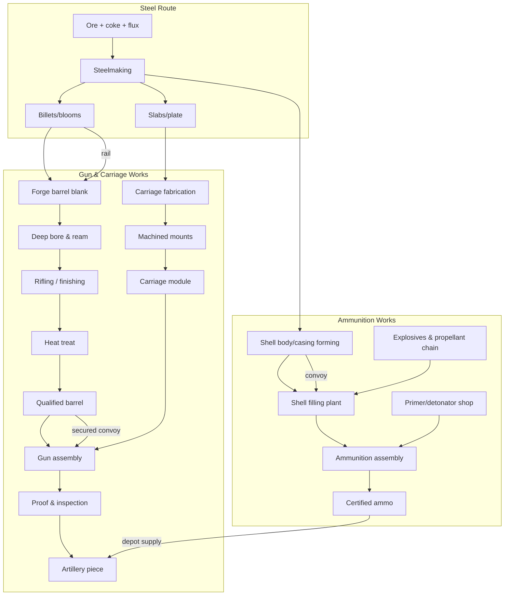
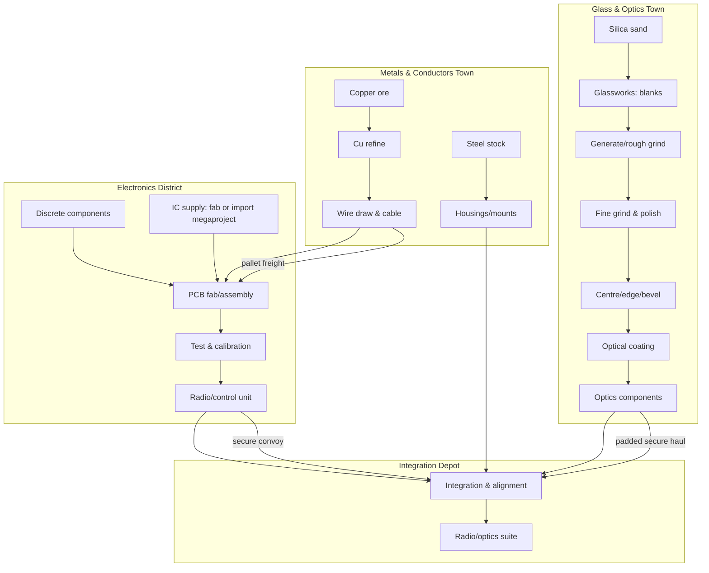
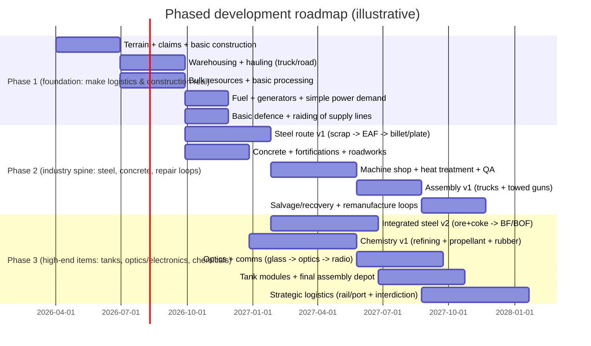

# Industrial Building Types and Dependency Graphs for a High‑Realism War‑Economy Game

## Executive summary

A genuinely “realistic” war‑economy game is not gated by research timers—it’s gated by **infrastructure**, **utilities**, **tooling**, **skilled labour**, and **logistics**. If players can build a heavy tank inside one settlement without a sprawling upstream industrial network, the economy will feel fake no matter how detailed your crafting UI is.

This report proposes (a) a complete catalogue of **process‑node buildings** (mines → material prep → metallurgy → fabrication/machining → assembly → sustainment), (b) three exemplar **DAGs** (heavy tank, artillery piece, radio/optics suite) that force **cross‑settlement movement** of semi‑finished goods, (c) settlement specialisations that naturally emerge from industrial bottlenecks, and (d) a phased development roadmap that lets you ship something playable long before the “full economy simulator” is finished.

Key reality checks underpinning the design:
- Modern steelmaking is dominated by two production routes (ore‑based BF‑BOF and scrap‑based EAF) and then a cascade of **casting/rolling/finishing** steps—perfect for multi‑stage material forms (slab → plate → machined part). citeturn0search0turn0search4turn0search20  
- Refineries are complex facilities converting crude into multiple transport fuels and feedstocks; fuel becomes a strategic choke point rather than a generic consumable. citeturn0search1turn0search9  
- Cement/concrete supply chains have multiple distinct steps (quarrying/crushing, grinding/blending, kiln/clinker, finish grinding/loading), which maps cleanly to construction realism and “build time” without arbitrary timers. citeturn0search2turn0search6  
- Logistics and sustainment are operationally foundational (supply, maintenance, distribution/deployment, engineering, health services), which is exactly the loop you want to monetise in gameplay. citeturn0search3turn0search7turn0search31  
- Semiconductor‑class electronics are a whole separate industrial universe (photolithography, deposition, etch, ion implant, packaging, tight metrology), so you either scope the era carefully or treat “microelectronics” as a rare megaproject/import. citeturn1search1turn1search17  

## Industrial‑realism model

A high‑realism war economy works when **form and process** matter more than “recipe lists”. In real industry, the path from ore to equipment is dominated by: (1) conversion of raw materials into **standardised intermediate forms**, (2) **thermal processing** (melting, heat treatment, curing), and (3) precision shaping/inspection before final assembly. Steel is a canonical example: ore/coal/limestone → iron/steel → semi‑finished products (slab/billet/bloom) → hot‑rolled/finished products. citeturn0search0turn0search20turn0search28

**Design implication:** your “building types” should be **industrial stations**, not “all‑purpose crafting tables”. Players specialise because each station has hard requirements:
- **Utilities:** power, process heat/fuel, water (cooling/processing), and sometimes industrial gases (e.g., oxygen for steelmaking; clean/inert environments for electronics). Steelmaking’s process evolution and plant efficiency improvements explicitly link energy and water use to production routes and finishing operations. citeturn0search12turn0search20turn0search28  
- **Labour and skill:** mines and quarries can run with lots of basic labour plus safety oversight, but machining/metrology and electronics/optics require high skill and quality systems. Precision manufacturing leans hard on metrology practices (calibration, in‑process measurement, surface texture measurement) to keep tolerances under control. citeturn2search3turn2search12turn2search6  
- **Material loops (without cycles):** many real workflows “bounce” between stages—rough machine → heat treat → finish machine → inspect/rework. Heat treatment (normalising, quenching, tempering) changes properties and is a distinct processing step you can’t hand‑wave if you want realism. citeturn2search1turn2search10  
- **Energy‑intensive conversion steps:** melting and casting are energetically expensive because you’re moving large masses through phase change and handling high temperatures; this makes foundries and smelters strategic targets. citeturn1search20turn1search24turn1search32  

### Standardised fields used in the building catalogue

To keep the catalogue rigorous but usable, each building is described with:
- **Key inputs / outputs:** “dominant” flows (not a full Bill of Materials).
- **Utilities:** coded as `P` (electric power), `W` (process/cooling water), `H` (process heat/fuel), plus occasional notes for `G` (industrial gases) and `C` (compressed air).
  - Values: `—` (not required), `L` (low), `M` (medium), `H` (high), `X` (extreme).
- **Labour/skill level:** `Basic`, `Skilled trades`, `Technician`, `Engineer/chemist`.
- **Throughput scale:** `Small / Medium / Large` relative to settlements.
- **Strategic value / vulnerability:** short, gameplay‑oriented “why this matters” plus how easy it is to cripple.

## Recommended building catalogue

The catalogue below is intentionally shaped around **near‑modern / industrial‑age** production, and is grounded in canonical process references from entity["organization","World Steel Association","global steel industry body"], entity["organization","American Iron and Steel Institute","us steel industry association"], entity["organization","U.S. Energy Information Administration","us energy statistics agency"], entity["organization","U.S. Environmental Protection Agency","us environmental regulator"], entity["organization","U.S. Geological Survey","us earth science agency"], entity["organization","National Institute of Standards and Technology","us standards lab"], entity["organization","U.S. Department of Energy","us energy department"], entity["organization","UK Ministry of Defence","uk defence ministry"], entity["organization","National Physical Laboratory","uk measurement institute"], and entity["organization","University of Arizona","tucson optics education"]. citeturn0search0turn0search4turn0search1turn0search2turn1search2turn1search1turn2search12turn2search2turn0search7

image_group{"layout":"carousel","aspect_ratio":"16:9","query":["integrated steel plant blast furnace basic oxygen furnace","continuous casting steel slabs plant","hot strip rolling mill glowing steel","tank assembly line factory interior"],"num_per_query":1}

### Governance, finance, contracts, and workforce

These buildings are how you make war “financially real” without goofy cooldowns: projects complete faster because you’ve built the **institutions** and paid for the **capacity**.

| Building type | Purpose | Key inputs | Key outputs | Utilities | Labour/skill | Scale | Strategic value / vulnerability |
|---|---|---|---|---|---|---|---|
| Settlement Office | Land claims, zoning, building permits, ownership rules | Population records, maps | Permits, zoning, lawful build radius | P:L W:— H:— | Technician | Small | High strategic; “soft” target (paperwork choke) |
| Treasury & Payroll Office | Taxes, payroll, war bonds, NPC contractor payments | Currency, contracts | Payroll, subsidies, loans | P:L W:— H:— | Technician | Small | High strategic; raids disrupt wages → labour loss |
| Contract & Procurement Board | Market‑making for hauling/building/production | Orders, bids | Work orders, NPC hire tickets | P:L W:— H:— | Technician | Small | High leverage; enables “pay NPCs to build faster” |
| Labour Exchange / Hiring Hall | Converts population into staffed shifts | Population, wages | Assigned labour pools | P:L W:— H:— | Basic | Small | Medium value; denial slows everything |
| Technical School / Apprenticeship Hall | Trains skilled roles (machinists, welders, electricians) | Tools, instructors | Skill progression, certifications | P:M W:L H:L | Technician | Medium | High value; bottleneck for high‑tier industry |
| Safety & Inspection Office | Enforces safe ops, unlocks higher hazard tech | Standards, labs | Licences, incident response | P:M W:L H:— | Engineer/chemist | Small | High value; without it, high‑hazard plants run “degraded” |
| Standards & Metrology Lab | Calibration, gauge certification, QA | Reference artefacts | Calibration certificates, scrap reduction | P:M W:L H:— | Technician | Small | High leverage; boosts yields, reduces defects citeturn2search3turn2search12turn2search6 |
| Hospital (Civil) | Keeps workforce alive (attrition sink) | Medicines, water | Treated workers | P:M W:M H:L | Technician | Medium | Medium value; supports long wars |

### Extraction and salvage

Mining and industrial minerals define what regions matter; entity["organization","U.S. Geological Survey","us earth science agency"]’s annual mineral summaries are a good reality anchor for “what actually becomes strategic”. citeturn1search2turn1search18turn1search34

| Building type | Purpose | Key inputs | Key outputs | Utilities | Labour/skill | Scale | Strategic value / vulnerability |
|---|---|---|---|---|---|---|---|
| Iron Ore Mine | Ore extraction for steel chain | Explosives, fuel, tools | ROM iron ore, waste rock | P:M W:L H:H | Skilled trades | Large | Very high value; vulnerable to blockade/sabotage |
| Coal Mine | Fuel + coke feedstock | Fuel, supports | Thermal coal, coking coal | P:M W:L H:H | Skilled trades | Large | Very high value; feeds power + metallurgy |
| Limestone Quarry | Flux for steel + cement feed | Fuel, blasting | Limestone | P:M W:L H:M | Skilled trades | Large | High value; often a regional choke |
| Aggregate Pit/Quarry | Gravel/crushed stone for roads & concrete | Fuel, equipment | Aggregate | P:M W:L H:M | Basic | Large | High value; logistics multiplier |
| Sand Pit | Glass, concrete, foundry sand | Fuel, screens | Sand | P:M W:L H:M | Basic | Medium | Medium value; vital for optics/glass |
| Clay Pit | Brick/ceramic/refractory feed | Fuel, tools | Clay | P:L W:L H:M | Basic | Medium | Medium value; enables refractory chain |
| Copper Mine | Conductors + electronics base | Explosives, fuel | Copper ore | P:M W:L H:H | Skilled trades | Medium | High value; scarcity drives conflict |
| Sulphur / Industrial Minerals Mine | Chemistry chain (fertiliser/explosives) | Fuel, tools | Sulphur ore, salts | P:M W:L H:M | Skilled trades | Medium | High value; explosive supply choke |
| Oil Field Camp | Crude extraction | Drilling kit, power | Crude oil | P:M W:L H:H | Technician | Medium | Very high value; fuels + chemicals citeturn0search9turn0search1 |
| Gas Well Station | Gas for power/chem feed | Compressors, power | Natural gas | P:M W:L H:M | Technician | Medium | High value; enables flexible power citeturn0search9turn0search1 |
| Salvage & Dismantling Yard | Battlefield recovery | Recovery vehicles, labour | Sorted scrap, salvage parts | P:M W:L H:M | Skilled trades | Medium | High leverage; sustains long wars |

### Material preparation, fuel conversion, and industrial heat

This category is where you turn “rocks and trees” into **furnace‑ready inputs** and **high‑temperature capability**. It directly supports realism in casting and steel routes. citeturn0search4turn0search0turn1search24turn1search20

| Building type | Purpose | Key inputs | Key outputs | Utilities | Labour/skill | Scale | Strategic value / vulnerability |
|---|---|---|---|---|---|---|---|
| Ore Crushing & Screening Plant | Size reduction for processing/smelting | ROM ore, power | Sized ore, fines | P:M W:L H:— | Basic | Medium | Medium value; easy to raid, slows output |
| Ore Washing/Beneficiation Plant | Removes gangue, upgrades feed | Ore, water | Concentrate, tailings | P:M W:H H:— | Technician | Medium | High value; water‑dependent choke |
| Coal Preparation Plant | Grades coal for coke/power | Coal, power | Coking coal fraction, rejects | P:M W:L H:— | Basic | Medium | High value; feeds coke ovens |
| Charcoal Kiln Complex | Early reducing agent; off‑grid fuel | Timber | Charcoal | P:L W:L H:H | Basic | Small | Medium value; good frontier industry |
| Coke Oven Battery | Coke production for blast furnace | Coking coal | Coke, by‑products | P:M W:M H:H | Technician | Large | Very high value; high vulnerability to attack citeturn0search4turn0search0 |
| Lime Kiln | Produces lime/flux for metallurgy & cement | Limestone, fuel | Lime | P:L W:L H:H | Basic | Medium | High value; supports multiple chains |
| Refractory Works | Furnace linings, crucibles, ladles | Clay, alumina, fuel | Firebrick, linings | P:M W:L H:H | Skilled trades | Medium | Very high leverage; without it, furnaces degrade |
| Industrial Gas Plant (O₂/N₂) | Oxygen for high‑temp processes; nitrogen/inert uses | Power, air | O₂, N₂ | P:H W:M H:M | Technician | Large | Strategic; single‑point failure for advanced industry |

### Ferrous metallurgy, casting, forming, and heat treatment

Steelmaking routes and subsequent casting/rolling steps are well documented by worldsteel and AISI. In‑game, these buildings should be **expensive**, **utility‑hungry**, and **fragile** if cut off from logistics (ore/coal/flux or scrap and power). citeturn0search0turn0search4turn0search8turn0search28turn0search20

| Building type | Purpose | Key inputs | Key outputs | Utilities | Labour/skill | Scale | Strategic value / vulnerability |
|---|---|---|---|---|---|---|---|
| Blast Furnace (Ironmaking) | Turns ore into hot metal | Iron ore, coke, limestone | Hot metal, slag | P:M W:H H:H | Engineer/chemist | Large | Top‑tier strategic; hard to restart if lost citeturn0search4 |
| Basic Oxygen Furnace Shop | Refining hot metal into steel | Hot metal, scrap, oxygen | Molten steel | P:M W:H H:H (G:O₂) | Engineer/chemist | Large | Very high value; target for air raids |
| Electric Arc Furnace Shop | Scrap‑based steelmaking | Scrap, electricity, oxygen | Molten steel | P:H W:M H:M (G:O₂) | Engineer/chemist | Large | High value; power‑grid dependent citeturn0search28turn0search8 |
| Continuous Caster | Steel → slab/billet/bloom | Molten steel | Slabs/billets/blooms | P:H W:H H:— | Technician | Large | High value; water/cooling choke citeturn0search20turn0search0 |
| Ingot Casting Bay | Lower tech casting route | Molten steel | Ingots | P:M W:M H:— | Skilled trades | Medium | Medium value; slower, flexible |
| Hot Rolling Mill (Plate/Strip) | Slab → plate/sheet/coil | Slabs, power | Plate/coil | P:H W:H H:H | Technician | Large | Very high value; feeds armour + vehicles |
| Section/Bar Mill | Billet/bloom → beams/bars/rail | Billets, power | Bars, sections | P:H W:M H:H | Technician | Large | High value; builds infrastructure & frames |
| Forge & Press Shop | High‑strength parts (shafts, barrel blanks) | Billets, heat | Forgings | P:M W:M H:H | Skilled trades | Medium | High value; key for guns/engines citeturn3search0turn3search10 |
| Foundry (Ferrous) | Cast housings, nodes, wheels | Molten metal, moulds | Castings | P:M W:M H:H | Skilled trades | Medium | High value; melt shops are raid magnets citeturn1search0turn1search24turn1search20 |
| Pattern & Mould Shop | Tooling for casting | Timber/resin/sand | Patterns, mould rigs | P:M W:L H:L | Skilled trades | Small | High leverage; cheap way to choke foundry |
| Welding & Heavy Fabrication Hall | Hulls, structures, frames | Plate/sections, consumables | Welded assemblies | P:H W:L H:M | Skilled trades | Medium | High value; pipelines of hull/turret work |
| Heat Treatment Shop | Property control (quench/temper/normalise) | Parts, quench media | Treated parts | P:M W:M H:H | Technician | Medium | High value; mandatory for weapon/drive parts citeturn2search1turn2search10 |
| Surface Treatment & Paint | Corrosion resistance, finish | Coatings, solvents | Coated parts | P:M W:L H:L | Technician | Medium | Medium value; boosts durability, toxic hazards |

### Precision machining, metrology, and small critical parts

This is where “realism” either pays off or collapses. If machining and inspection are trivial, players will brute‑force everything locally. If they matter, you naturally get specialisation and trade because precision capacity is scarce. citeturn2search3turn2search12turn2search6turn2search0

| Building type | Purpose | Key inputs | Key outputs | Utilities | Labour/skill | Scale | Strategic value / vulnerability |
|---|---|---|---|---|---|---|---|
| Machine Shop (General) | Turning/milling/drilling | Bar/plate, tooling | Machined parts | P:H W:L H:L | Skilled trades | Medium | High value; drives every advanced chain |
| Precision CNC Shop | Tight‑tolerance parts | Treated parts, gauges | Precision parts | P:H W:L H:L | Technician | Medium | Very high value; bottleneck for advanced gear |
| Tool & Die Shop | Jigs, fixtures, dies, gauges | Tool steel, machines | Tooling, gauges | P:H W:L H:M | Technician | Small | Extreme leverage; enables mass production |
| Gear Cutting Shop | Gears for transmissions, traverse systems | Alloy steel, cutters | Gears | P:H W:L H:L | Technician | Small | High value; small footprint, huge impact |
| Bearing Works | Bearings/bushings/pins | Steel, heat treat | Bearings | P:H W:L H:M | Technician | Small | High leverage; failure cripples vehicles |
| Fastener Plant | Bolts/rivets/screws | Wire/rod | Fasteners | P:M W:L H:M | Skilled trades | Medium | Medium value; volume sink |
| Quality Inspection Lab | CMM/measurement workflows | Standards, parts | Pass/fail, scrap stats | P:M W:L H:— | Technician | Small | High value; reduces waste citeturn2search3turn2search12 |

### Construction materials, civil engineering, and “build time realism”

Real build time comes from moving and transforming bulk materials (aggregate → cement → concrete; quarrying → crushing → kiln/clinker → grinding). Cement supply chains are explicitly multi‑stage, and the kiln/clinker system is the centre of gravity. citeturn0search2turn0search6

| Building type | Purpose | Key inputs | Key outputs | Utilities | Labour/skill | Scale | Strategic value / vulnerability |
|---|---|---|---|---|---|---|---|
| Cement Plant | Clinker + cement grinding | Limestone, clay, fuel | Cement | P:H W:M H:H | Engineer/chemist | Large | Very high value; huge fuel dependency |
| Concrete Batching Plant | Cement + aggregate mixing | Cement, aggregate, water | Concrete | P:M W:H H:— | Basic | Medium | High value; frontline fortifications rely on it |
| Brickworks & Ceramic Kilns | Bricks/tiles/ceramics | Clay, fuel | Bricks/ceramics | P:M W:L H:H | Skilled trades | Medium | Medium value; supports housing, drains |
| Sand‑Lime Products Plant | Blocks/pavers | Sand, lime | Blocks | P:M W:M H:M | Basic | Medium | Medium value; good mid‑tier construction |
| Roadworks Depot | Roads, drainage, earthworks | Aggregate, asphalt, fuel | Roads, culverts | P:M W:L H:H | Skilled trades | Medium | High strategic; logistics multiplier |
| Bridge Works Yard | Bridges/pontoons | Steel, timber, cranes | Bridge modules | P:M W:L H:M | Skilled trades | Medium | High value; controls manoeuvre routes |
| Sawmill & Timber Yard | Lumber and construction timber | Logs | Boards/beams | P:M W:L H:L | Basic | Medium | Medium value; vital early game |
| Timber Drying/Seasoning Yard | Controls moisture/quality | Lumber, heat | Dry lumber | P:M W:L H:M | Basic | Small | Medium value; reduces defects/warp |
| Joinery & Carpentry Works | Crates, stocks, frames | Dry timber | Joinery goods | P:M W:L H:L | Skilled trades | Small | Medium value; logistics packaging choke |

### Oil refining, chemicals, explosives, propellants, polymers

Fuel and chemistry are the cheat codes of real war: mobility, explosives, lubricants, sealants, coatings, and industrial reagents. Refineries split/reconfigure crude into multiple products and feedstocks. citeturn0search9turn0search1turn0search5

| Building type | Purpose | Key inputs | Key outputs | Utilities | Labour/skill | Scale | Strategic value / vulnerability |
|---|---|---|---|---|---|---|---|
| Oil Refinery | Fuels + feedstocks | Crude oil | Petrol/diesel/jet, feedstocks, bitumen | P:H W:H H:H | Engineer/chemist | Large | Tier‑0 strategic; catastrophic if lost citeturn0search1turn0search9 |
| Fuel & Lubricant Blending Plant | Special lubricants/fluids | Refinery cuts, additives | Lubricants, hydraulic fluid | P:M W:L H:L | Technician | Medium | High value; keeps vehicles alive |
| Basic Chemical Plant | Acids/alkalis/solvents | Feedstocks, power | Industrial chemicals | P:H W:H H:M | Engineer/chemist | Large | High value; toxic + raid‑sensitive |
| Fertiliser/Nitrates Plant | Food + explosives precursor logic | Gas/feedstocks | Fertiliser/nitrates | P:H W:H H:M | Engineer/chemist | Large | Strategic; links agriculture to war |
| Explosives Works | High explosives manufacture | Chemical precursors | Explosive fill | P:H W:M H:M | Engineer/chemist | Medium | Extreme strategic + extreme vulnerability (blast risk) |
| Propellant Plant | Propellant powders | Precursors | Propellant | P:H W:M H:M | Engineer/chemist | Medium | High value; ammo bottleneck |
| Primer/Detonator Shop | Ignition components | Chemicals, metal cups | Primers/detonators | P:M W:L H:L | Technician | Small | High leverage; tiny plant, huge effect |
| Rubber & Seal Works | Tyres, seals, hoses | Polymer feed, fillers | Tyres/seals/hoses | P:M W:L H:M | Skilled trades | Medium | High value; mobility bottleneck |
| Paint & Coatings Works | Corrosion/finish systems | Resins, solvents | Coatings | P:M W:L H:L | Technician | Small | Medium value; durability multiplier |

### Glass, optics, and electronics

Optics manufacturing is a crisp multi‑stage chain (blank generation → grinding → polishing → centring/edging → coating). That flow is explicitly described in optics manufacturing references and is a great template for “specialist towns.” citeturn2search2turn2search26

Semiconductor‑class electronics, on the other hand, is not “a bench”—it’s a network of specialised processing tools and metrology that’s usually far beyond what a single player settlement can bootstrap. NIST’s semiconductor manufacturing references show distinct equipment groups for photolithography, deposition, ion implant, etch, and integrated handling/control. citeturn1search1turn1search21turn1search17

| Building type | Purpose | Key inputs | Key outputs | Utilities | Labour/skill | Scale | Strategic value / vulnerability |
|---|---|---|---|---|---|---|---|
| Glassworks (Industrial) | Glass blank production | Sand, alkalis, heat | Glass stock/blanks | P:H W:M H:H | Technician | Medium | High value; feeds optics + industry |
| Optics Shop | Grind/polish lenses & prisms | Glass blanks, abrasives | Finished optics | P:M W:M H:L | Technician | Small | High value; rare skill gate citeturn2search2turn2search26 |
| Optical Coating Plant | Anti‑reflective/protective coatings | Optics, coating materials | Coated optics | P:H W:L H:M | Technician | Small | High leverage; enables “premium sights” |
| Electronics Assembly Plant | Radios/vehicle looms | Copper wire, components | Electronic assemblies | P:H W:L H:L | Technician | Medium | High value; fragile supply chain |
| Cable & Wire Mill | Copper → wire/harness feed | Copper | Wire/rod/cable | P:H W:M H:M | Skilled trades | Medium | High value; enables comms + motors |
| PCB Fabrication Shop | Boards for radios/control | Chemicals, copper foil | PCBs | P:H W:H H:M | Engineer/chemist | Medium | High value; toxic/water dependent |
| Semiconductor Fab (Megaproject / Capital City) | Produces ICs | Ultra‑pure chemicals/materials | Chips | P:X W:X H:M | Engineer/chemist | Large | Game‑defining strategic target citeturn1search17turn1search1 |
| Electronics Test & Calibration Lab | QA/testing | Test gear | Certified products | P:M W:— H:— | Technician | Small | High leverage; reduces failures in field |

### Utilities, storage, and logistics infrastructure

The core logistics functions (supply, maintenance, distribution/deployment, engineering, health services, etc.) are formally treated as foundational doctrine in major logistics publications. That’s not flavour text; it’s your gameplay loop. citeturn0search3turn0search7turn0search31

| Building type | Purpose | Key inputs | Key outputs | Utilities | Labour/skill | Scale | Strategic value / vulnerability |
|---|---|---|---|---|---|---|---|
| Power Plant (Coal) | Bulk grid power | Coal, water | Electricity | P:— W:H H:H | Technician | Large | Tier‑0 target; grid collapse cascades |
| Power Plant (Gas) | Flexible grid power | Gas, water | Electricity | P:— W:M H:H | Technician | Medium | High value; fast to restore vs coal |
| Generator Yard (Diesel) | Remote/FOB power | Diesel | Electricity | P:— W:L H:H | Basic | Small | Medium value; fuel‑logistics choke |
| Substation & Grid Control | Distribute power | Power | Stable supply | P:L W:— H:— | Technician | Medium | High leverage; “easy” sabotage node |
| Water Intake & Pumping | Industrial water | River/groundwater | Pressurised water | P:H W:— H:— | Technician | Medium | High value; cripples steel/cement/chem |
| Water Treatment Works | Potable/process water | Raw water, chemicals | Treated water | P:H W:— H:L | Technician | Medium | High value; public health + industry |
| Sewage/Waste Works | Sanitation, waste processing | Wastewater | Treated effluent | P:M W:— H:L | Technician | Medium | Medium value; supports large cities |
| Fuel Depot (Secure) | Fuel storage & rationing | Refined fuels | Stored fuels | P:L W:— H:— | Basic | Medium | Very high value; explosive hazard |
| Warehouse | General storage | Goods | Buffered inventory | P:L W:— H:— | Basic | Medium | High value; makes supply resilient |
| Bulk Yard | Ore/coal/timber/aggregate buffers | Bulk goods | Stockpiles | P:L W:— H:— | Basic | Large | High value; visible target, easy to burn |
| Cold Store | Food/medical cold chain | Power, insulation | Preserved supplies | P:M W:— H:L | Basic | Small | Medium value; supports endurance |
| Truck Depot & Motor Pool | Dispatch road logistics | Fuel, vehicles | Convoys | P:M W:L H:M | Skilled trades | Medium | High value; raiding convoys matters |
| Rail Yard & Freight Terminal | High‑volume transport | Locomotives, cranes | Bulk shipments | P:M W:L H:M | Skilled trades | Large | Extreme strategic; route choke |
| Port & River Dock | Bulk transport by water | Cranes, barges | Bulk shipments | P:M W:L H:M | Skilled trades | Large | Extreme strategic; vulnerable shoreline node |
| Distribution & Dispatch Centre | Routing, scheduling | Orders, inventory | Routed shipments | P:M W:— H:— | Technician | Medium | High value; “brain” of logistics |

### Military production, assembly, and sustainment

These are “final mile” buildings. They should be unable to function without upstream metallurgy, precision, chemistry, logistics, and QA.

| Building type | Purpose | Key inputs | Key outputs | Utilities | Labour/skill | Scale | Strategic value / vulnerability |
|---|---|---|---|---|---|---|---|
| Vehicle Final Assembly Yard | Assemble AFVs/vehicles | Modules, tools | Vehicles | P:H W:L H:M | Technician | Medium | Very high value; supply‑dependent |
| Engine Works (Assembly & Test) | Assemble engines | Castings, parts | Tested engines | P:H W:M H:M | Technician | Medium | High value; test capacity is a hard gate |
| Transmission Works | Gearboxes/final drives | Gears, housings | Transmissions | P:H W:L H:M | Technician | Small | High leverage; tiny throughput choke |
| Artillery Assembly & Proof Range | Assemble/test guns | Barrel, carriage | Certified artillery | P:M W:L H:M | Technician | Small | High value; proofing makes QA real |
| Ammunition Assembly Plant | Assemble shells/cartridges | Cases, propellant, primers | Ammo | P:H W:L H:M | Technician | Medium | Extreme leverage; ammo wins wars |
| Shell Forging/Casing Plant | Forms shell bodies/cases | Steel/brass | Shell bodies/cases | P:H W:L H:H | Skilled trades | Medium | High value; metallurgy + forming link |
| Shell Filling Plant | Fill shells with explosive | Explosives, shells | Filled munitions | P:M W:L H:L | Engineer/chemist | Small | Extreme risk; needs safety systems |
| Signals Depot (Military) | Secure comms distribution | Radios | Issued kits | P:L W:— H:— | Basic | Small | High leverage; comms denial is real |

### Repair, recovery, and remanufacture

This is how you keep wars from being a pure “craft new” meta. It also creates a salvage economy and makes victories compound.

| Building type | Purpose | Key inputs | Key outputs | Utilities | Labour/skill | Scale | Strategic value / vulnerability |
|---|---|---|---|---|---|---|---|
| Field Workshop (FOB) | Quick repairs | Spares, tools | Patched equipment | P:L W:L H:L | Skilled trades | Small | Medium value; keeps front alive |
| Vehicle Repair Depot | Major vehicle repairs | Spares, cranes | Restored vehicles | P:M W:L H:M | Technician | Medium | High value; reduces replacement demand |
| Heavy Maintenance & Remanufacture | Rebuild engines/gearboxes | Worn modules | Reman modules | P:H W:M H:M | Technician | Medium | Very high value; deep sustainment gate |
| Scrap Sorting & Re‑melt Yard | Recycling loop | Scrap | Feedstock | P:M W:L H:M | Skilled trades | Medium | High value; supports EAF route citeturn0search28turn0search8 |
| QA Rework & Salvage Lab | Reduce scrap losses | Failed parts | Repaired parts | P:M W:L H:L | Technician | Small | High leverage; boosts effective capacity |

### Security and hardening

If industry matters, it must be vulnerable—and defendable. Don’t make everything a hitpoint sponge; make specific nodes fragile (power, pumping, control rooms, bridges, fuel farms).

| Building type | Purpose | Key inputs | Key outputs | Utilities | Labour/skill | Scale | Strategic value / vulnerability |
|---|---|---|---|---|---|---|---|
| Guard Post & Checkpoint | Route control | Staff, comms | Controlled access | P:L W:— H:— | Basic | Small | Medium value; anti‑sabotage layer |
| Watchtower / Observation Post | Early warning | Staff | Detection | P:L W:— H:— | Basic | Small | Medium value; reduces surprise raids |
| Armoury & Secure Store | Controlled weapon storage | Weapons, locks | Issued weapons | P:L W:— H:— | Basic | Small | High value; denies enemy capture |
| Ammunition Bunker | Safer explosive storage | Ammo | Stored ammo | P:L W:— H:— | Basic | Small | Very high value; catastrophic loss if hit |
| Hardened Command Bunker | Resilient admin node | Comms, power | Command continuity | P:M W:— H:— | Technician | Small | High strategic; protects decision layer |

## Exemplar production DAGs with cross‑settlement transport

The diagrams below are **directed acyclic** on purpose: real industry has feedback loops, but you can represent them without cycles by splitting “rework” into linear stages (rough → treat → finish → inspect). This keeps the graph computable while still forcing the “back‑and‑forth” logistics the design needs. The metallurgy backbone reflects BF‑BOF/EAF routes and downstream casting/rolling. citeturn0search0turn0search4turn0search8turn0search28turn0search20

### Heavy tank DAG

```mermaid
flowchart TB
  %% Settlements are subgraphs; transport edges are labelled.
  subgraph A[Mining Basin]
    FeMine[Iron ore mine] --> FePrep[Crush & beneficiation]
    CoalMine[Coal mine] --> CoalPrep[Coal prep plant]
    LimeQ[Limestone quarry] --> LimeCrush[Crush & screen]
    CuMine[Copper mine] --> CuCon[Concentrate]
    SandPit[Sand pit] --> SandGrade[Graded sand]
    OilField[Oil field] --> Crude[Crude oil]
  end

  subgraph B[Coking & Ironworks Town]
    CoalPrep --> Coke[Coke ovens]
    FePrep --> BF[Blast furnace]
    Coke --> BF
    LimeCrush --> BF
    BF --> HotMetal[Hot metal]
    HotMetal --> BOF[BOF steel shop]
  end

  subgraph C[Steel & Plate Mill City]
    BOF --> Caster[Continuous caster]
    Caster --> Slab[Slab]
    Slab --> Roll[Hot rolling mill]
    Roll --> Plate[Armour plate]
    Roll --> Bar[Bar/rod stock]
  end

  subgraph D[Fabrication & Machining Town]
    Plate --> Cut[Plate cutting]
    Cut --> Weld[Hull/turret fabrication]
    Weld --> StressRelief[Stress relieve / heat treat]
    StressRelief --> RoughMach[Heavy machining: rough]
    RoughMach --> FinalMach[Precision machining: finish]
    Bar --> Forge[Forge/press shop]
    Forge --> HT[Heat treatment shop]
    HT --> FinalMach
    FinalMach --> Hull[Finished hull module]
    FinalMach --> Turret[Finished turret module]
    FinalMach --> PowertrainParts[Powertrain parts]

    CastFoundry[Foundry: housings/castings] --> RoughMach
  end

  subgraph E[Chemistry & Fuels Complex]
    Crude --> Refinery[Oil refinery]
    Refinery --> Diesel[Diesel/fuel]
    Refinery --> Lubes[Lubricants/hydraulic fluids]
    Refinery --> Feedstocks[Chemical feedstocks]
    Feedstocks --> Rubber[Rubber & seals works]
    Feedstocks --> ExplChem[Explosives/propellant precursors]
  end

  subgraph F[Electronics & Optics Park]
    CuCon --> CuSmelt[Cu smelt/refine]
    CuSmelt --> Wire[Wire/cable mill]
    SandGrade --> Glass[Glassworks]
    Glass --> Optics[Optics shop]
    Optics --> Coat[Optical coating]
    Wire --> ElecAsm[Electronics assembly]
    SemiFab[Semiconductor fab (optional megaproject)] --> ElecAsm
    ElecAsm --> RadioSuite[Radios/loom/control units]
    Coat --> Sight[Optics/sights/periscopes]
  end

  subgraph G[Final Assembly Depot]
    Hull --> Assembly[Vehicle final assembly]
    Turret --> Assembly
    PowertrainParts --> EngineWorks[Engine & transmission works]
    EngineWorks --> Assembly
    Rubber --> Assembly
    Diesel --> Assembly
    Lubes --> Assembly
    RadioSuite --> Assembly
    Sight --> Assembly
    Assembly --> Tank[Heavy tank]
  end

  %% Transport links (between settlements)
  FePrep -- rail freight --> BF
  CoalPrep -- rail freight --> Coke
  Plate -- heavy haul --> Cut
  Wire -- secured convoy --> ElecAsm
  RadioSuite -- secured convoy --> Assembly
  Sight -- secured convoy --> Assembly
  Diesel -- tanker convoy --> Assembly
```

**Why this forces specialisation:** the tank is “assembled” in one place, but it is materially dependent on (a) an integrated steel flow (ironmaking → steelmaking → casting → rolling), (b) a precision machining cluster that can run heat‑treat → finish‑machining loops, and (c) an electronics/optics park whose inputs are entirely different (copper, glass, chemicals, clean QA). Semiconductor‑grade electronics are explicitly modelled as an optional megaproject because their process/tool ecology is in a different league to general metalwork. citeturn1search1turn1search17

### Artillery piece DAG

This shares the same industrial “spine” but shifts the bottleneck to **barrel forging/boring/heat treatment** and **munition filling**. Forging is a high‑temperature shaping process producing some of the strongest manufactured parts, and it sits naturally upstream of gun barrel blanks and recoil parts. citeturn3search0turn3search10



**Gameplay leverage:** artillery becomes a high‑end system that is “cheap” only if you already own the whole chain: billets, forging capacity, deep boring tools, heat‑treat throughput, and safe explosives handling. One sabotage on the boring shop or filling plant should stall production hard, which is exactly how you make strategic raids meaningful.

### Radio/optics suite DAG

Optics manufacturing is a clean multi‑stage craft‑industrial hybrid: blanks → generating/grinding → polishing → centring/edging → coating. citeturn2search2turn2search26  
Electronics manufacturing is broader; the “near‑modern” question is: do you model IC fabrication or not? NIST’s semiconductor manufacturing references show it’s not a single step but a network of tools and control layers. citeturn1search1turn1search21



**Blunt design takeaway:** if you let players “make chips” casually, you’ll either (a) lose realism instantly, or (b) accidentally turn your game into a semiconductor‑fab simulator with wars bolted on. The clean compromise is **tiered electronics**: make radios/vehicle looms achievable via copper + PCB + assembly/testing, while “microelectronics” sits behind a capital‑city megaproject or import pipeline. citeturn1search17turn1search1

## Settlement specialisation patterns

Specialisation should not be a hard rule (“you may only build X”). It should be an **economic gradient** driven by utilities, labour, and logistics costs. The table below recommends specialisations that mirror real industrial clustering: heavy industry concentrates around bulk transport and power/water; precision and electronics cluster around skilled labour and QA; assembly clusters around depots and secure logistics. This is consistent with logistics doctrine emphasis on distribution, maintenance, engineering, and health services as core functions. citeturn0search3turn0search7turn0search31

| Specialisation archetype | Core buildings | Primary exports | Key imports | Strategic value / typical weakness |
|---|---|---|---|---|
| Mining Basin | Mines, crushing, beneficiation, bulk yard, truck/rail terminal | Ore, concentrates, coal, stone | Fuel, explosives, machine spares | High value; fragile haul routes |
| Coking & Ironworks Town | Coke ovens, blast furnace, BOF, industrial gases, water pumping | Hot metal/steel slabs (or semi‑finished) | Ore, coal, limestone, refractory | Tier‑0 strategic; water/power sabotage cripples |
| Steel & Rolling City | Continuous caster, rolling/section mills, surface treatment | Plate/coil, bar/sections, rail | Slabs/billets, power, water | High value; needs uninterrupted utilities |
| Foundry & Fabrication Town | Foundry, pattern/mould shop, welding hall, heat treat | Castings, welded modules | Steel forms, sand, refractory, energy | High leverage; easy to stall via tooling |
| Precision Machining Town | CNC/precision shops, tool & die, metrology lab, bearing/gear works | Precision parts, gearboxes, jigs | Alloy stock, treated parts, power | Bottleneck; raid the metrology/tooling, output collapses |
| Chemistry & Fuels Complex | Refinery, chemical plant, explosives/propellant, rubber | Fuels, lubes, explosives, seals | Crude/gas, water, power | Strategic and volatile; disaster‑prone target |
| Electronics & Optics Park | Glassworks, optics shop, coating, PCB/electronics assembly, test lab | Sights, radios, looms | Copper, chemicals, high‑skill labour | High value; fragile, skill‑gated |
| Logistics Megahub | Port/rail yard, container yard, warehouses, dispatch centre, fuel farms | Distribution capacity | Everything | “Heart” node; losing it isolates whole regions |
| Final Assembly Depot | Vehicle assembly, engine/trans works, QA bay, depots | Finished vehicles/weapons | Modules from everywhere | High value; dependent on upstream deliveries |
| Sustainment & Remanufacture City | Heavy maintenance, remanufacture, salvage sorting, scrap remelt | Rebuilt modules, recycled feed | Wrecks, spares, energy | War‑endurance engine; attracts raids and salvage wars |

## Development roadmap

This roadmap prioritises **playable economic pressure** early, then layers realism depth where it changes player decisions (not where it just adds UI). The phasing assumes you want the “war is financed” fantasy to emerge from logistics and construction friction rather than timers.



**Phase logic (what you must not skip):**
- Phase 1: you need **storage, hauling, and build friction** so regions start to matter.
- Phase 2: you need a **materials spine** (steel + concrete) and **repair/remanufacture** so wars have endurance economics.
- Phase 3: you unlock the “cool stuff” (tanks, advanced artillery, optics/comms, fuel/chem), but those items should be a *consequence* of infrastructure, not a research timer.

## Complexity‑preserving abstractions

You want realism, but you also want a shippable game. Here are abstractions that keep the *shape* of real industry while cutting out the parts that are just spreadsheet pain.

1. **Material “forms” over full chemistry.** Track steel as forms + grade bands (e.g., `mild`, `alloy`, `armour`) and forms (`slab`, `plate`, `bar`, `casting`, `forging`). That preserves the “ingots aren’t magic” truth without simulating metallurgical phase diagrams.

2. **Batch processing instead of continuous simulation.** Let plants run in batches with capacity, warm‑up, and downtime, rather than ticking every second. This still makes power/fuel/logistics constraints bite.

3. **Utilities as capacity constraints, not piping micro‑management.** Model water/power/fuel as networked capacities with vulnerable nodes (substations, pumping stations, fuel depots). The strategic gameplay (raid the pump, stall the mill) stays intact.

4. **Quality as a probability distribution shaped by tooling + metrology.** Precision shops and inspection labs reduce defect rates and rework time rather than directly “unlocking” recipes. This mirrors how measurement and calibration underpin manufacturing performance. citeturn2search3turn2search12turn2search6

5. **Explicit “rework” stages.** Instead of cycles, implement linear rework stages (rough → treat → finish → inspect → rework). You get the back‑and‑forth logistics feel while keeping DAGs acyclic.

6. **Hazard classes drive permitting and insurance‑style costs.** Explosives and refineries should require Safety & Inspection and impose higher upkeep/risk. This replaces artificial cooldowns with believable institutional gates.

7. **Electronics tiering (era‑sane realism).** Radios and wiring can be domestically produced with copper + PCBs + assembly/testing, while advanced ICs are imports or a capital megaproject. This aligns with the reality that semiconductor manufacturing is multi‑tool, metrology‑heavy, and infrastructure extreme. citeturn1search1turn1search17

8. **NPC contractors as “convert money into throughput” with constraint caps.** Contractors shouldn’t bypass materials/utilities; they should bypass *labour availability* and *time to build* within a bounded capacity determined by the Contract Board + Treasury.

9. **Logistics friction via packaging and handling classes.** Bulk solids (ore/coal) vs hazardous liquids (fuel) vs sensitive goods (optics/electronics) should require different containers, depots, and transport rules—simple, but hugely effective.

10. **Strategic interdiction instead of base HP walls.** Make a few nodes truly critical (power substations, pumping, rail bridges, control rooms, fuel farms) so warfare has economic depth without needing hundreds of turret types.

11. **Proofing and certification gates for high‑end outputs.** Artillery and vehicles should require proof/testing steps; failing tests consumes time/material. This makes quality systems economically meaningful.

12. **“Industrial density” as a soft cap on mega‑cities.** Past a threshold, add escalating utility and governance overhead (waste, safety, inspections, power stability), so one settlement can’t trivially do everything without becoming a risk magnet.

The bottom line: if you build the economy around **process nodes + logistics + utilities**, players will self‑specialise because it’s rational—not because you limited professions. That’s the only way “realistically financed war” survives contact with actual players.